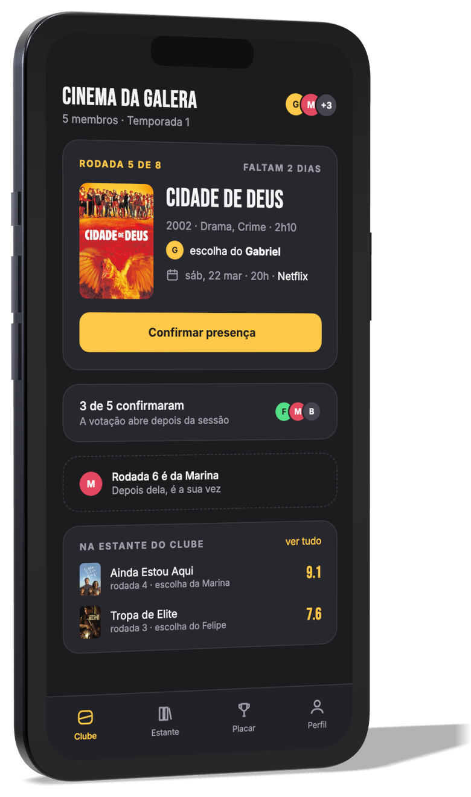
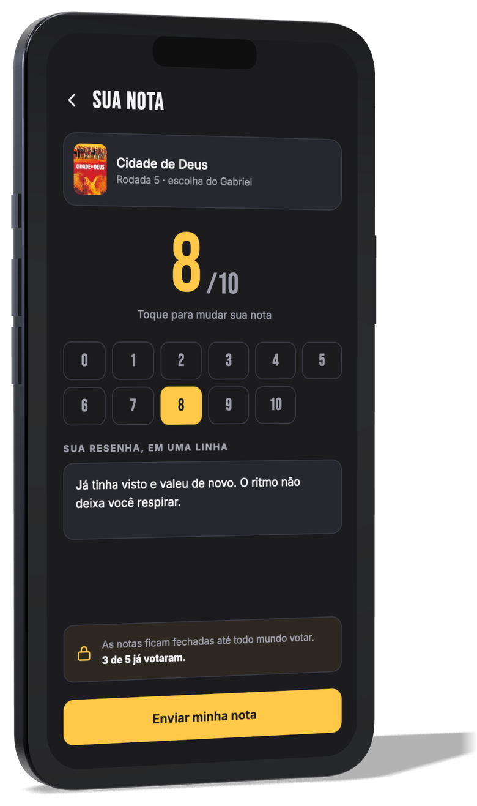
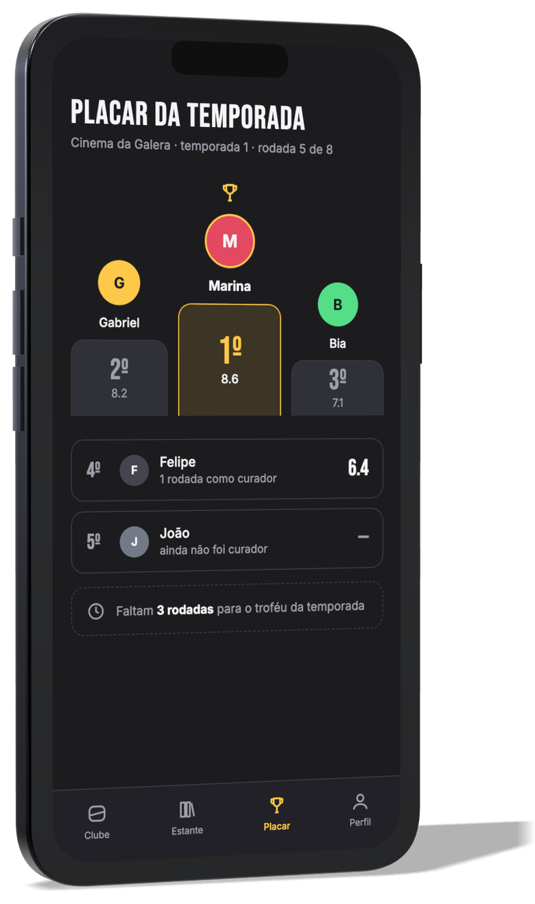

<div align="center">


# Claquete

**Toda semana um escolhe. Todo mundo julga.**

O clube de cinema dos seus amigos, com rodízio de curadoria e placar.


</div>

---

## 📖 Sobre o projeto

**Claquete** é um aplicativo mobile que transforma o "vamo marcar de assistir
alguma coisa" — aquela mensagem que morre no grupo do WhatsApp — em um ritual
semanal que realmente acontece.

A ideia é simples e vem de um formato que funciona há décadas fora do digital:
o **clube do livro**. Ninguém escolhe em comitê. Cada semana, **uma pessoa** é
a curadora e decide o filme de todo mundo. Depois que o grupo assiste, cada
integrante dá sua nota — e a média não vai para o filme, vai para **quem
escolheu**. No fim da temporada, o aplicativo premia quem tem o melhor gosto do grupo.

> Projeto desenvolvido para a disciplina **Mobile Development & IoT** (3º ano de
> Engenharia de Software — FIAP), como entrega contínua dos Checkpoints 4, 5 e 6.

## 🎯 O problema

Escolher filme em grupo é um problema de decisão coletiva com poder de veto:
cinco pessoas, cinco vetos, nenhuma decisão. O resultado é sempre o mesmo —
meia hora percorrendo catálogos, ninguém decide, e cada um acaba assistindo sozinho.

Os apps existentes não resolvem isso porque atacam outro problema:
catálogos organizam **o acervo**, diários de filme registram **o passado
individual**. Nenhum deles cria o **compromisso social** que faz a sessão
acontecer.

O detalhamento está no [documento de escopo](docs/01-escopo.pdf).

## ⚙️ Como funciona

| Etapa | O que acontece |
|---|---|
| 1. Clube | Um integrante cria o clube e convida o grupo por código |
| 2. Temporada | O clube define quantas rodadas terá a temporada (ex: 8 semanas) |
| 3. Curadoria | A cada rodada, o aplicativo define por rodízio quem escolhe o filme |
| 4. Sessão | O curador escolhe o filme e marca a data da sessão |
| 5. Notas | Após a sessão, cada integrante atribui nota de 0 a 10 e registra uma resenha de uma linha |
| 6. Revelação | As notas só aparecem quando **todos** votam — sem efeito manada |
| 7. Placar | A média da rodada é o ponto do curador na temporada |

## 📱 Telas conceituais

<div align="center">

  

</div>

São seis telas, com a identidade visual já aplicada. Nesta etapa elas são
**conceituais** — representam a interface pretendida, mas ainda não são
funcionais; a implementação começa no CP5.

A descrição de cada tela, o fluxo de navegação e as demais imagens estão no
[documento de telas](docs/04-telas.pdf).

## 📚 Documentação

| # | Documento | Conteúdo | Fonte |
|---|---|---|---|
| 01 | [**Escopo**](docs/01-escopo.pdf) | Problema, público-alvo, proposta de valor e escopo do MVP | [`01-escopo.md`](docs/markdown/01-escopo.md) |
| 02 | [**Marca**](docs/02-marca.pdf) | Nome, logo, paleta de cores, tipografia e tom de voz | [`02-marca.md`](docs/markdown/02-marca.md) |
| 03 | [**Pitch**](docs/03-pitch.pdf) | Modelo de negócio, monetização e diferencial competitivo | [`03-pitch.md`](docs/markdown/03-pitch.md) |
| 04 | [**Telas**](docs/04-telas.pdf) | Telas conceituais e fluxo de navegação | [`04-telas.md`](docs/markdown/04-telas.md) |
| 05 | [**Equipe**](docs/05-equipe.pdf) | Integrantes e papéis de cada um no projeto | [`05-equipe.md`](docs/markdown/05-equipe.md) |
| 06 | [**Roteiro do pitch**](docs/06-roteiro-pitch.pdf) | Roteiro de apresentação, slide a slide, com tempos e perguntas prováveis | [`06-roteiro-pitch.md`](docs/markdown/06-roteiro-pitch.md) |

### 🎤 Pitch deck

A apresentação do pitch, em três formatos:

| Formato | Arquivo | Para quê |
|---|---|---|
| PDF | [`claquete-pitch-deck.pdf`](docs/pitch-deck/claquete-pitch-deck.pdf) | Apresentar em tela cheia, com a formatação garantida |
| PowerPoint | [`claquete-pitch-deck.pptx`](docs/pitch-deck/claquete-pitch-deck.pptx) | Abrir no PowerPoint, Google Slides ou Keynote |
| Imagens | [`slides/`](docs/pitch-deck/slides) | Um PNG por slide, para inserir em outros documentos |

No arquivo do PowerPoint cada slide entra como imagem de página inteira — assim
a apresentação projeta idêntica ao PDF mesmo em um computador que não tenha as
fontes da marca instaladas.

Os PDFs são o documento de entrega; o Markdown em [`docs/markdown/`](docs/markdown)
é a fonte a partir da qual eles são gerados. Para regerar:

```bash
node scripts/build-docs-pdf.mjs       # documentos em PDF
node scripts/build-pitch-deck.mjs     # deck de apresentação (PDF)
node scripts/build-deck-formats.mjs   # deck em PPTX e imagens dos slides
```

## 🛠️ Stack técnica

| Camada | Escolha | Por quê |
|---|---|---|
| Framework | **React Native + Expo (SDK 57)** | Build único para Android e iOS e geração de APK via EAS no CP6 |
| Linguagem | **TypeScript** (strict) | Erros de contrato de dados aparecem em tempo de escrita, não em produção |
| Navegação | **Expo Router** | Rotas baseadas em arquivos, com tipagem automática das rotas |
| Tipografia | **@expo-google-fonts** | Fontes da marca embarcadas no bundle, sem depender de rede |
| Design tokens | Módulo próprio em `src/theme` | Cor e tipografia definidas em um lugar só, direto do manual da marca |

## 📁 Estrutura de pastas

```
claquete/
├── app/                     # Rotas do Expo Router (cada arquivo é uma tela)
│   ├── _layout.tsx          # Layout raiz: fontes, tema e navegação
│   └── index.tsx            # Tela de abertura da marca
├── src/
│   ├── theme/               # Design tokens: cores, tipografia, espaçamento
│   ├── components/          # Componentes reutilizáveis de interface
│   ├── features/            # Módulos por funcionalidade (clube, rodada, notas)
│   ├── data/                # Dados mockados, a partir do CP5
│   ├── hooks/               # Hooks compartilhados
│   ├── services/            # Integrações externas (ex.: TMDB)
│   ├── types/               # Tipos e contratos de dados
│   └── utils/               # Funções utilitárias
├── assets/
│   ├── brand/               # Logo, assinatura e símbolo
│   ├── mock/posters/        # Pôsteres usados nas telas conceituais
│   └── *.png                # Ícone do app, adaptive icon, splash e favicon
├── scripts/
│   ├── generate-brand-icons.mjs   # Gera os ícones a partir dos design tokens
│   ├── generate-wordmark.mjs      # Gera a assinatura da marca
│   ├── build-docs-pdf.mjs         # Converte a documentação em PDF
│   ├── build-pitch-deck.mjs       # Monta o deck de apresentação
│   ├── build-deck-formats.mjs     # Exporta o deck em PPTX e imagens
│   ├── deck/                      # Fonte do deck (HTML e estilo)
│   ├── pdf/                       # Estilo de impressão dos documentos
│   └── mockup-3d/                 # Cena 3D que gera os mockups de aparelho
└── docs/
    ├── 01-escopo.pdf … 06-roteiro-pitch.pdf   # Documentação (entrega)
    ├── markdown/                     # Fonte da documentação
    ├── pitch-deck/                   # Deck em PDF, PPTX e imagens
    └── telas/                        # Telas conceituais e mockups
```

## 🚀 Como rodar

**Pré-requisitos:** [Node.js](https://nodejs.org) 20 ou superior e npm.
Para rodar no celular, instale o app **Expo Go**
([Android](https://play.google.com/store/apps/details?id=host.exp.exponent) ·
[iOS](https://apps.apple.com/app/expo-go/id982107779)).

```bash
# 1. clonar o repositório
git clone https://github.com/FelipeMarquesdeOliveira/claquete.git
cd claquete

# 2. instalar as dependências
npm install

# 3. iniciar o projeto
npm start
```

Com o servidor no ar, escolha como abrir:

| Comando | Onde abre |
|---|---|
| `npm start` | Mostra o QR Code — escaneie com o Expo Go no celular |
| `npm run android` | Emulador Android (Android Studio) ou dispositivo conectado |
| `npm run ios` | Simulador iOS (somente macOS, requer Xcode) |
| `npm run web` | Navegador, em `http://localhost:8081` |

Para regerar os ícones da marca depois de mudar a paleta:

```bash
node scripts/generate-brand-icons.mjs
```

## 🗺️ Roadmap dos checkpoints

| Checkpoint | Entrega | Status |
|---|---|---|
| **CP4** | Idealização: marca, escopo, pitch e setup do projeto | ✅ Em entrega |
| **CP5** | Protótipo funcional com dados mockados e testes | ⏳ Planejado |
| **CP6** | App final e APK instalável via EAS Build | ⏳ Planejado |

## 👥 Equipe

| RM | Nome | Papel |
|---|---|---|
| RM556319 | **Felipe Marques** | Product Owner & Desenvolvedor Mobile |
| RM556309 | **Gabriel Barros Cisoto** | Designer de Produto & Estratégia de Negócio |

A divisão detalhada do trabalho por checkpoint está em
[documento da equipe](docs/05-equipe.pdf).

## 🎬 Créditos

Os pôsteres usados nas telas conceituais vêm do
**[The Movie Database (TMDB)](https://www.themoviedb.org)**. Este produto usa a
API do TMDB, mas não é endossado nem certificado pelo TMDB.

## 📄 Licença

Distribuído sob a licença MIT. Veja [LICENSE](LICENSE).
