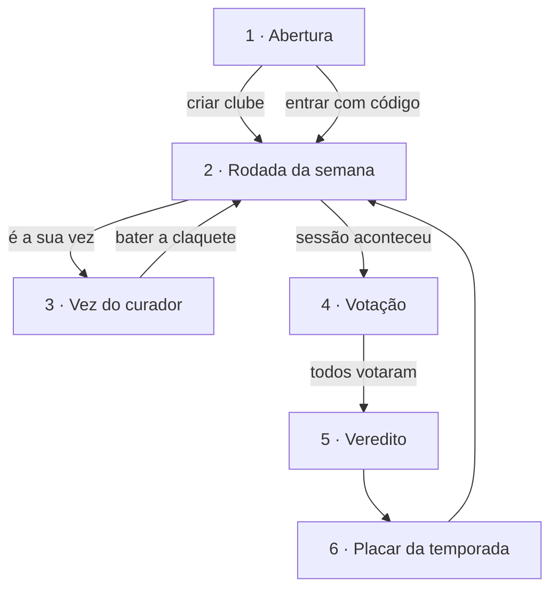

# 04 · Telas Conceituais e Fluxo

> Identidade visual aplicada às telas do app. As telas desta etapa são
> **conceituais**: representam a interface pretendida, mas ainda não são
> funcionais — a implementação começa no CP5.

---

## 1. Protótipo visual

🎬 **[Abrir as telas conceituais do Claquete](https://claude.ai/code/artifact/cd8d30a8-913f-499c-a325-f4fbdea29648)**

São seis telas em formato de celular (390 × 844), organizadas em um canvas
navegável, todas construídas com a paleta e a tipografia definidas em
[02-marca.md](02-marca.md). O canvas permite ampliar cada tela e exportar em
PNG ou PDF para anexar na apresentação.

## 2. Fluxo de navegação

O ciclo é fechado de propósito: o placar devolve o usuário para a próxima
rodada. É esse laço que sustenta a recorrência semanal do produto.

## 3. Descrição das telas

### 1 · Abertura
Primeiro contato com a marca. Apresenta o símbolo, a tagline e explica a
mecânica em três passos, antes de qualquer cadastro. Duas saídas: **criar um
clube** (quem traz o grupo) ou **entrar com um código** (quem foi convidado).

- Elementos: símbolo, assinatura, três passos numerados, ação principal e secundária
- Decisão de design: a mecânica é explicada **antes** do login, porque o app só faz sentido se o usuário entender a regra do rodízio

### 2 · Rodada da semana
Tela principal do app, e a que o usuário abre com mais frequência. Mostra a
rodada atual: o filme escolhido, quem escolheu, a data da sessão e quanto falta.

- Elementos: nome do clube, avatares do grupo, cartão da rodada com pôster e dados do filme, confirmação de presença, quem já confirmou, aviso de quem é o próximo curador
- Decisão de design: o cartão da rodada domina a tela — não há feed nem catálogo competindo por atenção

### 3 · Vez do curador
Aparece **apenas** para quem é o curador da rodada. É a tela onde a escolha
acontece, com prazo visível.

- Elementos: aviso de prazo em vermelho, busca de filme, resultados com o selecionado destacado, definição da data da sessão, botão "bater a claquete"
- Decisão de design: o prazo em `#E23E57` é o único uso de vermelho na jornada, reservado para urgência real
- A linha "disponível no Prime Video" é o ponto onde entra o link de afiliado descrito no [pitch](03-pitch.md)

### 4 · Votação
Liberada depois da data da sessão. Nota de 0 a 10 e uma linha de resenha.

- Elementos: filme em miniatura, nota selecionada em destaque, escala de 0 a 10, campo de resenha, aviso de sigilo com contador de votos
- Decisão de design: o cadeado e a frase "as notas ficam fechadas até todo mundo votar" aparecem na hora do voto, não depois — é o que garante que o usuário vote com sinceridade

### 5 · Veredito
O momento de maior valor do app: as notas são reveladas de uma vez.

- Elementos: média do clube em destaque, lista de todos os votos com resenha, pontuação creditada ao curador e sua nova posição
- Decisão de design: a média aparece em corpo grande e âmbar porque é o "resultado da rodada"; as notas individuais vêm logo abaixo, com nome e cara de cada um

### 6 · Placar da temporada
Onde a competição de curadoria vive. Pódio dos três primeiros e a lista dos
demais.

- Elementos: pódio com alturas diferentes, posições restantes, contagem de rodadas até o troféu
- Decisão de design: quem ainda não foi curador aparece com "—" no lugar da nota, deixando claro que a pontuação vem de **escolher**, não de votar

## 4. Padrões de interface adotados

| Padrão | Definição |
|---|---|
| **Navegação** | Barra inferior com quatro seções: Clube, Estante, Placar e Perfil |
| **Cartões** | Raio de 20 px, fundo `surface` e borda de 1 px em `border` |
| **Ação principal** | Botão de 52 px de altura, fundo âmbar e texto escuro — um por tela |
| **Ação secundária** | Mesma altura, apenas contorno, sem preenchimento |
| **Estado "sua vez"** | Vermelho `secondary`, exclusivo de urgência e prazo |
| **Números** | Sempre em Bebas Neue: notas, médias e posições |
| **Ícones** | Traço de 2 px em grade de 24 px, sem emoji |
| **Área de toque** | Mínimo de 44 px em qualquer elemento tocável |

## 5. O que ainda não foi desenhado

Telas previstas para o CP5 e o CP6, fora do escopo desta entrega:

- Estante (histórico do clube), Perfil e configurações do clube
- Fluxo de criação de clube e convite de membros, passo a passo
- Estados de vazio, carregamento e erro
- Notificações push de "sua vez" e "sessão hoje"
